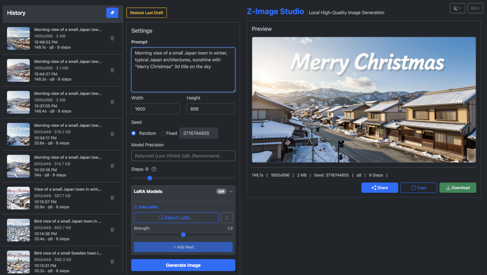
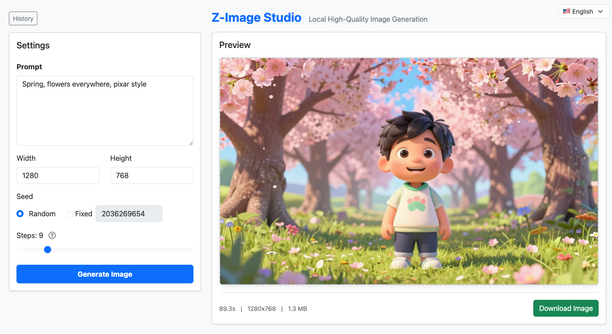
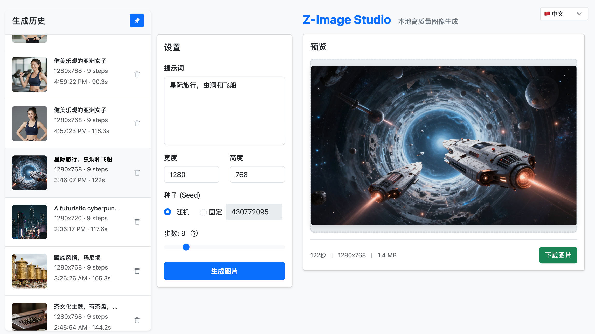
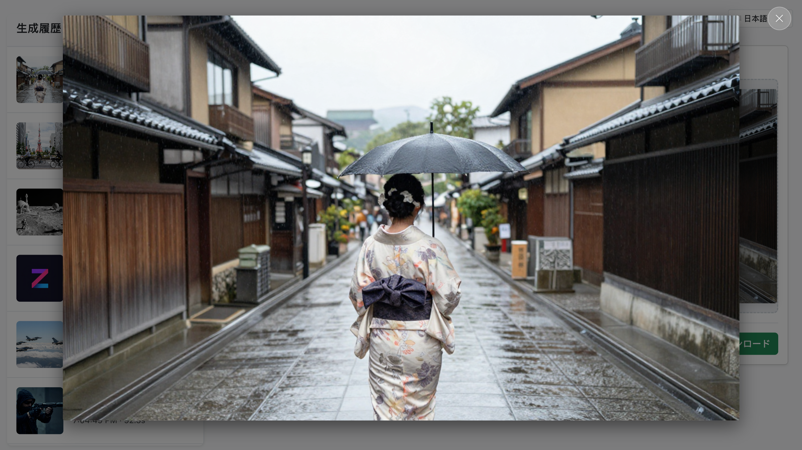

# Z-Image Studio


[](https://opensource.org/licenses/Apache-2.0)
[](https://github.com/astral-sh/uv)


[](https://deepwiki.com/iconben/z-image-studio)

A Cli, a webUI, and a MCP server for the **Z-Image-Turbo** text-to-image generation model (`Tongyi-MAI/Z-Image-Turbo` and its variants).

This tool is designed to run efficiently on local machines for Windows/Mac/Linux users. It features specific optimizations for **NVIDIA (CUDA)**, **Apple Silicon (MPS)**, and **AMD on Linux (ROCm)**, falling back to CPU if no compatible GPU is detected.



## Features
**Hybrid Interfaces**: 
  *   **CLI**: Fast, direct image generation from the terminal.
  *   **Web UI**: Modern web interface for interactive generation.
  *   **MCP Server**: Capability to be called by AI agents.

### CLI and core features
*   **Z-Image-Turbo Model**: Utilizes the high-quality `Tongyi-MAI/Z-Image-Turbo` model and quatized variants via `diffusers`.
*   **MPS Acceleration**: Optimized for Mac users with Apple Silicon.
*   **ROCm Support**: Explicitly supported on Linux for AMD GPUs.
*   **Attention Slicing Auto-detection**: Automatically manages memory usage (e.g., enables attention slicing for systems with lower RAM/VRAM) to prevent Out-of-Memory errors and optimize performance.
*   **Seed Control**: Reproducible image generation via CLI or Web UI.
*   **Multiple LoRA Support**: Upload/manage LoRAs in the web UI, apply up to 4 with per-LoRA strengths in a single generation; CLI supports multiple `--lora` entries with optional strengths.
*   **Automatic Dimension Adjustment**: Ensures image dimensions are compatible (multiples of 16).
*   **Customizable Output Directory**: Image output directory can be customized via config file and environment variable.

### Web UI features
*   **Multilanguage Support**: English, Japanese, Chinese Simplified (zh-CN), and Chinese Traditional (zh-TW) are supported.
*   **History Browser**: Efficiently search and browse your past generations with a paginated history that loads more items as you scroll.
*   **Hardware-aware Model Recommendation**: The Web UI dynamically presents model precision options based on your system's detected RAM/VRAM, recommending the optimal choice for your hardware. You can also inspect available models and recommendations via the CLI.
*   **Image Sharing**: The generated image can be downloaded to browser download directory, conveniently shared via OS share protocol, and copied into clipboard. 
*   **Theme Switch**: Light, dark and auto themes.
*   **Mobile compatible**: Responsive layout for mobile devices.

### MCP features
*   **MCP Server (stdio + SSE + Streamable HTTP)**: Expose tools for image generation, listing models, and viewing history over Model Context Protocol; stdio entrypoints (`zimg mcp`, `zimg-mcp`) for local agents, SSE available at `/mcp-sse`, and MCP 2025-03-26 Streamable HTTP transport at `/mcp`.
*   **Transport-Agnostic Content**: All transports (stdio, SSE, Streamable HTTP) return identical structured content for consistent agent integration.
*   **Client Transport Selection**: Clients should try Streamable HTTP (`/mcp`) first for optimal performance, falling back to SSE (`/mcp-sse`) if needed.

## Requirements

*   Python >= 3.11
*   `uv` (recommended for dependency management)

**Python 3.12+ Note**: `torch.compile` is disabled by default for Python 3.12+ due to known compatibility issues with the Z-Image model architecture. If you want to experiment with `torch.compile` on Python 3.12+, set `ZIMAGE_ENABLE_TORCH_COMPILE=1` via environment variable or in `~/.z-image-studio/config.json` (experimental, may cause errors).

## GPU acceleration notes

*   **NVIDIA (CUDA)**: Works with standard PyTorch CUDA builds.
*   **Apple Silicon (MPS)**: Uses PyTorch MPS backend on macOS.
*   **AMD on Linux (ROCm)**: Explicitly supported on Linux.
    > **Note**: AMD GPU support currently requires ROCm, which is only available for Linux PyTorch builds. Windows users with AMD GPUs will currently fall back to CPU.
    *   **Installation**: Install AMD ROCm drivers/runtime for your distribution. Then install PyTorch with ROCm support (e.g., via `pip install torch --index-url https://download.pytorch.org/whl/rocm6.1` or similar). Ensure the PyTorch ROCm version matches your installed driver version.
    *   **Verification**: The app will automatically detect your device as "rocm". You can confirm this by running `zimg models`.
    *   **Troubleshooting**:
        *   If the app falls back to CPU, ensure `torch.version.hip` is detected.
        *   **HSA Override**: For some consumer GPUs (e.g., RX 6000/7000 series) not officially supported by all ROCm versions, you may need to set `HSA_OVERRIDE_GFX_VERSION` (e.g., `10.3.0` for RDNA2, `11.0.0` for RDNA3).
        *   **Performance**: `torch.compile` is disabled by default on ROCm due to experimental support. You can force-enable it with `ZIMAGE_ENABLE_TORCH_COMPILE=1` if your setup (Triton/ROCm version) supports it.

## Global installation

If you just want the `zimg` CLI to be available from anywhere, install it as a uv tool:

```bash
uv tool install git+https://github.com/iconben/z-image-studio.git
# or, if you have the repo cloned locally:
# git clone https://github.com/iconben/z-image-studio.git
# cd z-image-studio
# uv tool install .
```

After this, the `zimg` command is available globally:

```bash
zimg --help
```

To update z-image-studio:
```bash
uv tool upgrade z-image-studio
# or, if you have the repo cloned locally, you pull the latest source code:
# git pull
```

## Windows Installation

For Windows users, a pre-built installer is available that bundles everything you need:

1. Download the latest installer from [GitHub Releases](https://github.com/iconben/z-image-studio/releases)
2. Run `Z-Image-Studio-Windows-x64-x.x.x.exe`
3. Follow the installation wizard
4. Launch from the Start Menu:
   - **Z-Image Studio (Web UI)**: Starts the web server and opens your browser
   - **Z-Image Studio CLI**: Opens a console for command-line usage

### Installation Details

*   **Install Location**: `C:\Program Files\Z-Image Studio`
*   **User Data**: `%LOCALAPPDATA%\z-image-studio` (contains database, LoRAs, and outputs)
*   **Uninstall**: Use "Add or Remove Programs" or the uninstall shortcut in the Start Menu

### System Requirements

*   Windows 10 or Windows 11
*   NVIDIA GPU with CUDA support (recommended) or compatible AMD GPU
*   8GB+ RAM (16GB+ recommended for full precision models)

## Docker Installation

Run Z-Image Studio in a container with Docker:

### Quick Start

```bash
# Create persistent volume
docker volume create zimg-data

# Run the container
docker run -d \
  --name z-image-studio \
  -p 8000:8000 \
  -v zimg-data:/data \
  -v zimg-config:/home/appuser/.z-image-studio \
  -v zimg-outputs:/data/outputs \
  iconben/z-image-studio:latest
```

Then open http://localhost:8000 in your browser.

### With Docker Compose

Create a `docker-compose.yml` file:

```yaml
services:
  z-image-studio:
    image: iconben/z-image-studio:latest
    container_name: z-image-studio
    ports:
      - "8000:8000"
    volumes:
      - zimg-data:/data
      - zimg-config:/home/appuser/.z-image-studio
      - zimg-outputs:/data/outputs
    restart: unless-stopped

volumes:
  zimg-data:
  zimg-config:
  zimg-outputs:
```

Then run:

```bash
docker compose up -d
```

#### With GPU Support

**NVIDIA GPU:**
```yaml
services:
  z-image-studio:
    image: iconben/z-image-studio:latest
    container_name: z-image-studio
    ports:
      - "8000:8000"
    volumes:
      - zimg-data:/data
      - zimg-config:/home/appuser/.z-image-studio
      - zimg-outputs:/data/outputs
    deploy:
      resources:
        reservations:
          devices:
            - driver: nvidia
              count: all
              capabilities: [gpu]
    restart: unless-stopped

volumes:
  zimg-data:
  zimg-config:
  zimg-outputs:
```

**AMD GPU (Linux):**
```yaml
services:
  z-image-studio:
    image: iconben/z-image-studio:latest
    container_name: z-image-studio
    ports:
      - "8000:8000"
    volumes:
      - zimg-data:/data
      - zimg-config:/home/appuser/.z-image-studio
      - zimg-outputs:/data/outputs
    devices:
      - /dev/dri:/dev/dri
    restart: unless-stopped

volumes:
  zimg-data:
  zimg-config:
  zimg-outputs:
```

Then run:

```bash
docker compose up -d
```

### With Docker Run

**Basic:**
```bash
docker run -d \
  --name z-image-studio \
  -p 8000:8000 \
  -v zimg-data:/data \
  -v zimg-config:/home/appuser/.z-image-studio \
  -v zimg-outputs:/data/outputs \
  iconben/z-image-studio:latest
```

**NVIDIA GPU:**
```bash
docker run -d \
  --name z-image-studio \
  -p 8000:8000 \
  --gpus all \
  -v zimg-data:/data \
  -v zimg-config:/home/appuser/.z-image-studio \
  -v zimg-outputs:/data/outputs \
  iconben/z-image-studio:latest
```

**AMD GPU (Linux):**
```bash
docker run -d \
  --name z-image-studio \
  -p 8000:8000 \
  --device /dev/dri:/dev/dri \
  -v zimg-data:/data \
  -v zimg-config:/home/appuser/.z-image-studio \
  -v zimg-outputs:/data/outputs \
  iconben/z-image-studio:latest
```

### Data Persistence

The container uses Docker volumes for persistence:

| Volume | Path | Description |
|--------|------|-------------|
| `zimg-data` | `/data` | Database and LoRA storage |
| `zimg-outputs` | `/data/outputs` | Generated images |
| `zimg-config` | `/home/appuser/.z-image-studio` | User configuration |

### Environment Variables

| Variable | Default | Description |
|----------|---------|-------------|
| `HOST` | `0.0.0.0` | Server bind host |
| `PORT` | `8000` | Server bind port |
| `Z_IMAGE_STUDIO_DATA_DIR` | `/data` | Database and LoRA storage |
| `Z_IMAGE_STUDIO_OUTPUT_DIR` | `/data/outputs` | Generated images |
| `ZIMAGE_BASE_URL` | Auto | Base URL for generated links |
| `ZIMAGE_DISABLE_MCP` | `0` | Disable MCP endpoints |
| `ZIMAGE_ENABLE_TORCH_COMPILE` | Auto | Force torch.compile |

### Development Mode

Mount source code for development:

```bash
docker run -d \
  --name z-image-studio-dev \
  -p 8000:8000 \
  -v $(pwd)/src:/app/src \
  -v zimg-data:/data \
  -e DEBUG=1 \
  iconben/z-image-studio:latest
```

### Management Commands

```bash
# View logs
docker logs -f z-image-studio

# Stop container
docker stop z-image-studio

# Remove container (data preserved)
docker rm z-image-studio

# Remove all data
docker volume rm zimg-data zimg-outputs zimg-config
```

## pip / uv Installation

Install Z-Image Studio via pip or uv:

```bash
pip install z-image-studio
# or
uv pip install z-image-studio
```

After installation, the `zimg` command is available globally:

```bash
zimg --help
```

### From Source

```bash
git clone https://github.com/iconben/z-image-studio.git
cd z-image-studio
pip install -e .
# or
uv pip install -e .
```

## Usage

After installation, you can use the `zimg` command directly from your terminal.

### 1. CLI Generation (Default Mode)
Generate images directly from the command line using the `generate` (or `gen`) subcommand.

```bash
# Basic generation
zimg generate "A futuristic city with neon lights"

# Using the alias 'gen'
zimg gen "A cute cat"

# Custom output path
zimg gen "A cute cat" --output "my_cat.png"

# High quality settings
zimg gen "Landscape view" --width 1920 --height 1080 --steps 20

# With a specific seed for reproducibility
zimg gen "A majestic dragon" --seed 12345

# Select model precision (full, q8, q4)
zimg gen "A futuristic city" --precision q8

# Skip writing to history DB
zimg gen "Quick scratch" --no-history
```

### 2. Web Server Mode
Launch the web interface to generate images interactively.

```bash
# Start server on default port (http://localhost:8000)
zimg serve

# Start on custom host/port
zimg serve --host 0.0.0.0 --port 9090
```

Once started, open your browser to the displayed URL.

### 3. MCP Server Mode (Model Context Protocol)
Run Z-Image Studio as an MCP server:

```bash
# stdio transport (ideal for local agents/tools); also available as `zimg mcp`
zimg-mcp

# MCP transports are available when you run the web server:
zimg serve          # Both Streamable HTTP (/mcp) and SSE (/mcp-sse) available
zimg serve --disable-mcp   # Disable all MCP endpoints
```

Available tools: `generate` (prompt to image), `list_models`, and `list_history`. Logs are routed to stderr to keep MCP stdio clean.

#### Connecting an AI agent (e.g., Claude Desktop) to `zimg-mcp`
1. Ensure dependencies are installed (`uv sync`) and that `zimg-mcp` is on PATH (installed via `uv tool install .` or run locally via `uv run zimg-mcp`).
2. In Claude Desktop (or any MCP-aware client), add a local mcp server entry like:
   ```json
   {
     "mcpServers": {
       "z-image-studio": {
         "command": "zimg-mcp",
         "args": [],
         "env": {}
       }
     }
   }
   ```
   Adjust the `command` to a full path if not on PATH. If the agent cannot find the zimg-mcp command, you can also try setting the path in environment.

   Different agents may have slightly different parameters, for example, cline will timeout fast if you do not explicitly set a timeout parameter. Here is the example for cline:
   ```json
   {
     "mcpServers": {
       "z-image-studio": {
         "command": "zimg-mcp",
         "type": "stdio",
         "args": [],,
         "env": {},
         "disabled": false,
         "autoApprove": [],
         "timeout": 300
       }
     }
   }
   ```
   Detailed syntax may vary, please refer to the specific agent's documentation.
3. For Clients that support remote mcp server, configure the client with the streamable Http mcp endpoint URL (meanwhile keep the server up by running `zimg serve`). Here is an example for Gemini CLI:
   ```json
   {
     "mcpServers": {
       "z-image-studio": {
         "httpUrl": "http://localhost:8000/mcp"
       }
     }
   }
   ```
   Detailed syntax may vary, please refer to the specific agent's documentation.
4. For legacy SSE , run `zimg serve` and configure the client with the SSE endpoint URL. Here is an example for Cline CLI:
   ```json
   {
     "mcpServers": {
       "z-image-studio": {
         "url": "http://localhost:8000/mcp-sse/sse"
       }
     }
   }
   ```
   Detailed syntax may vary, please refer to the specific agent's documentation.
5. The agent will receive tools: `generate`, `list_models`, `list_history`.


#### MCP Content Structure

The `generate` tool returns a consistent content array with three items in this order:

1. **TextContent**: Enhanced metadata including generation info, file details, and preview metadata
   ```json
   {
     "message": "Image generated successfully",
     "duration_seconds": 1.23,
     "width": 1280,
     "height": 720,
     "precision": "q8",
     "model_id": "z-image-turbo-q8",
     "seed": 12345,
     "filename": "image_12345.png",
     "file_path": "/absolute/path/to/image_12345.png",
     "access_note": "Access full image via ResourceLink.uri or this URL",
     "preview": true,
     "preview_size": 400,
     "preview_mime": "image/png"
   }
   ```
   - **SSE/Streamable HTTP Transports**: `url` and `access_note` point to the absolute image URL
   - **Stdio Transport**: `file_path` and `access_note` point to the local file path

2. **ResourceLink**: Main image file reference with context-appropriate URI
   - **SSE/Streamable HTTP Transports**: Absolute URL built from request context, ZIMAGE_BASE_URL, or relative path
   - **Stdio Transport**: file:// URI for local access

   URI Building Priority (SSE/Streamable HTTP):
   1. **Request Context** (via Context parameter) - builds absolute URL from X-Forwarded-* headers
   2. **ZIMAGE_BASE_URL** environment variable - configured base URL
   3. **Relative URL** - fallback when no other method available
   
   Example with Context parameter:
   ```python
   @mcp.tool()
   async def generate_with_context(..., ctx: Context) -> ...:
       request = ctx.request_context.request
       proto = request.headers.get('x-forwarded-proto', 'http')
       host = request.headers.get('x-forwarded-host', 'localhost')
       return ResourceLink(uri=f"{proto}://{host}/outputs/image.png", ...)
   ```
   ```json
   {
     "type": "resource_link",
     "name": "image_12345.png",
     "uri": "https://example.com/outputs/image_12345.png",
     "mimeType": "image/png"
   }
   ```

3. **ImageContent**: Thumbnail preview (base64 PNG, max 400px)
   ```json
   {
     "data": "base64-encoded-png-data",
     "mimeType": "image/png"
   }
   ```

This structure ensures:
- ✅ **Consistency**: Same content for both stdio and SSE transports
- ✅ **Efficiency**: No URL/path duplication across content items
- ✅ **Flexibility**: ResourceLink provides file access while ImageContent offers immediate preview
- ✅ **Compatibility**: Follows MCP best practices for structured content types

## Command Line Arguments

### Subcommand: `generate` (alias: `gen`)
| Argument | Short | Type | Default | Description |
| :--- | :--- | :--- | :--- | :--- |
| `prompt` | | `str` | Required | The text prompt for image generation. |
| `--output` | `-o` | `str` | `None` | Custom output filename. Defaults to `outputs/<prompt-slug>.png` inside the data directory. |
| `--steps` | | `int` | `9` | Number of inference steps. Higher usually means better quality. |
| `--width` | `-w` | `int` | `1280` | Image width (automatically adjusted to be a multiple of 8). |
| `--height` | `-H` | `int` | `720` | Image height (automatically adjusted to be a multiple of 8). |
| `--seed` | | `int` | `None` | Random seed for reproducible generation. |
| `--precision` | | `str` | `q8` | Model precision (`full`, `q8`, `q4`). `q8` is the default and balanced, `full` is higher quality but slower, `q4` is fastest and uses less memory. |
| `--lora` | | `str` | `[]` | LoRA filename or path, optionally with strength (`name.safetensors:0.8`). Can be passed multiple times (max 4); strength is clamped to -1.0..2.0. |
| `--no-history` | | `bool` | `False` | Do not record this generation in the history database. |

### Subcommand: `serve`
| Argument | Type | Default | Description |
| :--- | :--- | :--- | :--- |
| `--host` | `str` | `0.0.0.0` | Host to bind the server to. |
| `--port` | `int` | `8000` | Port to bind the server to. |
| `--reload` | `bool` | `False` | Enable auto-reload (for development). |
| `--timeout-graceful-shutdown` | `int` | `5` | Seconds to wait for graceful shutdown before forcing exit. |
| `--disable-mcp` | `bool` | `False` | Disable all MCP endpoints (`/mcp` and `/mcp-sse`). |

### Subcommand: `models`
| Argument | Short | Type | Default | Description |
| :--- | :--- | :--- | :--- | :--- |
| (None)   |       |       |         | Lists available image generation models, highlights the one recommended for your system's hardware, and displays their corresponding Hugging Face model IDs. |

### Subcommand: `mcp`
| Argument | Type | Default | Description |
| :--- | :--- | :--- | :--- |
| (none) | | | Stdio-only MCP server (for agents). Use `zimg-mcp` or `zimg mcp`. |


## Data Directory and Configuration

By default, Z-Image Studio uses the following directories:

*   **Data Directory** (Database, LoRAs): `~/.local/share/z-image-studio` (Linux), `~/Library/Application Support/z-image-studio` (macOS), or `%LOCALAPPDATA%\z-image-studio` (Windows).
*   **Output Directory** (Generated Images): `<Data Directory>/outputs` by default. 

### Configure the directory
*   **Config File**: `~/.z-image-studio/config.json` (created on first run after migration).
    *   Override the data directory with `Z_IMAGE_STUDIO_DATA_DIR`.
    *   If you want the output directory sit in another location instead of the data directory, you can override it with `Z_IMAGE_STUDIO_OUTPUT_DIR`.

Directory structure inside Data Directory by default:
*   `zimage.db`: SQLite database
*   `loras/`: LoRA models
*   `outputs/`: Generated image files

### One-time Migration (automatic)
On first run without an existing config file, the app migrates legacy data by moving:
*   `outputs/`, `loras/`, and `zimage.db` from the current working directory (old layout) into the new locations.


## Screenshots


*(Screenshot 1: Two column layout with History browser collapsed)*


*(Screenshot 2: Three column layout with History browser pinned)*



*(Screenshot 3: Generated Image zoomed to fit the screen)*


## Development

### Installation in Project Virtual Environment

1.  **Clone the repository:**
    ```bash
    git clone https://github.com/iconben/z-image-studio.git
    cd z-image-studio
    ```

### To run the source code directly without installation:

1.  **Run CLI:**
    ```bash
    uv run src/zimage/cli.py generate "A prompt"
    ```

2.  **Run Server:**
    ```bash
    uv run src/zimage/cli.py serve --reload
    ```

3.  **Run tests:**
    ```bash
    uv run pytest
    ```

### Optional: Install in editable mode:**
    First install it:
    ```bash
    uv pip install -e .
    ```

    After this, the `zimg` command is available **inside this virtual environment**:

    Then use the zimg command in either ways:

    Using `uv` (recommended):
    ```bash
    uv run zimg generate "A prompt"
    ```

    or use in more traditional way:
    ```bash
    source .venv/bin/activate  # Under Windows: .venv\Scripts\activate
    zimg serve
    ```

### Optional: Override the folder settings with environment variables
     If you do not want your development data mess up your production data,
     You can define environment variable Z_IMAGE_STUDIO_DATA_DIR to change the data folder for
     You can also define environment variable Z_IMAGE_STUDIO_OUTPUT_DIR to change the output folder to another separate folder

### Docker Development

Build and run with Docker:

```bash
# Build the image
docker build -t z-image-studio:dev .

# Run with source mounted for hot-reload
docker run -d \
  --name zimg-dev \
  -p 8000:8000 \
  -v $(pwd)/src:/app/src \
  -v zimg-data:/data \
  -e DEBUG=1 \
  -e ZIMAGE_ENABLE_TORCH_COMPILE=1 \
  z-image-studio:dev
```

Or use Docker Compose:

```bash
docker compose up -d
```

### Environment Variables
| Variable | Description |
| :--- | :--- |
| `ZIMAGE_ENABLE_TORCH_COMPILE` | Force enable `torch.compile` optimization (experimental). By default disabled for Python 3.12+ due to known compatibility issues. Can be set to `1` via environment variable or config file (`~/.z-image-studio/config.json`) to enable at your own risk. |
| `Z_IMAGE_STUDIO_DATA_DIR` | Override the default data directory location. |
| `Z_IMAGE_STUDIO_OUTPUT_DIR` | Override the default output directory location. |
## Notes

*   **Guidance Scale**: The script hardcodes `guidance_scale=0.0` as required by the Turbo model distillation process.
*   **Safety Checker**: Disabled by default to prevent false positives and potential black image outputs during local testing.

For detailed architecture and development guidelines, see [docs/architecture.md](docs/architecture.md).
